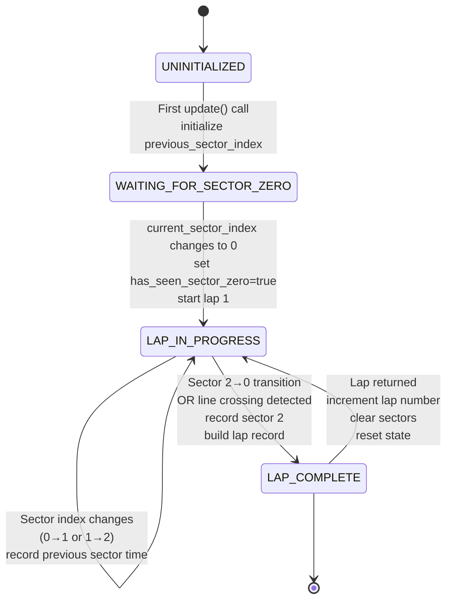

# acc-telemetry-rs

A Windows-only Rust application that automatically records lap times and sector splits from Assetto Corsa Competizione (ACC) to JSON files for analysis.

## What it does

- **Automatic Lap Recording**: Detects and records every lap completion with sector times
- **JSON Export**: Saves session data to organized JSON files in `.recordings/` directory
- **Session Statistics**: Calculates best lap, average lap time, and categorizes laps (normal/pit/invalid)
- **Smart Session Detection**: Waits for active session before capturing metadata (prevents stale data from previous sessions)
- **Real-time Feedback**: Displays lap times in console as they complete
- **Multiple Sessions**: Creates unique files per session with track, car, and timestamp in filename

## Features

- 📊 **Lap Time Tracking** - Records total lap time and individual sector times
- 🏁 **Sector Splits** - Captures timing for each sector (works with 2, 3, 4+ sector tracks)
- 📁 **Auto-Save** - Writes JSON after each lap (no data loss on crashes)
- 🏎️ **Session Metadata** - Track, car, player name, session type, timestamps
- 📈 **Statistics** - Best lap, average lap, lap counts by status
- 🔄 **Session Changes** - Handles track/car changes gracefully
- ⏱️ **Pit Detection** - Identifies and excludes pit laps from averages

## How It Works

### Lap Detection State Machine

The lap recorder uses a state machine to ensure complete and accurate lap recordings. The system only records complete laps (starting from sector 0) to avoid partial or invalid data.



#### State Descriptions

- **UNINITIALIZED:** Initial state when `LapRecorder` is created. Waiting for first telemetry update.
  
- **WAITING_FOR_SECTOR_ZERO:** Telemetry data is being received and `previous_sector_index` is initialized, but we haven't seen sector 0 yet. Recording doesn't start until we've confirmed at least one complete sector cycle exists.
  
- **LAP_IN_PROGRESS:** Currently recording a lap. Transitions occur when `current_sector_index` changes:
  - Entering sector 1 from 0 → record sector 0's time
  - Entering sector 2 from 1 → record sector 1's time
  - Entering sector 0 from 2 → record sector 2's time and move to LAP_COMPLETE
  
- **LAP_COMPLETE:** Lap record has been built and is ready to return. After returning, immediately starts the next lap and returns to LAP_IN_PROGRESS.

#### Key Points

- **No partial laps:** Recording only starts after sector 0 is seen, ensuring complete [0, 1, 2, ...] cycles
- **Atomic transitions:** Lap completion and start happen in single update cycle to prevent sector misassignment
- **Sector-indexed recording:** Sectors are recorded when entering the NEXT sector (uses `last_sector_time` from just-completed sector)
- **Line crossing detection:** Uses `normalized_car_position` wrap (>0.5 → <0.5) to detect lap boundaries in addition to sector transitions
- **Complete data guarantee:** All recorded laps contain all sectors in correct order with no duplicates or data leakage

## Quick Start

1. **Build** the application (requires Rust + MSVC toolchain on Windows)
2. **Launch** Assetto Corsa Competizione and enter any session
3. **Run** `acc-telemetry-rs.exe`
4. **Drive** and complete laps - they're automatically recorded!
5. **Exit** with Escape - find your data in `.recordings/`

See [USAGE.md](USAGE.md) for detailed instructions.

## Example Output

### Console
```
╔════════════════════════════════════════════════════════════════╗
║          ACC Telemetry Recorder - Lap Time Logger            ║
╚════════════════════════════════════════════════════════════════╝

Active session detected!

Session Info:
  Track:   Monza
  Car:     Ferrari 488 GT3
  Player:  Michael Napoleon
  Session: Practice

Recording to: .recordings/Monza_Ferrari488GT3_2026-03-01_143000.json

Lap 1 completed: 2:25.340 [normal]
Lap 2 completed: 2:24.890 [normal]
Lap 3 completed: 3:45.220 [pit]
```

### JSON File
```json
{
  "metadata": {
    "car_model": "Ferrari 488 GT3",
    "track": "Monza",
    "session_type": "Practice",
    "total_laps_recorded": 15
  },
  "laps": [
    {
      "lap_number": 1,
      "status": "normal",
      "total_time_formatted": "2:25.340",
      "sectors": [
        {"index": 0, "formatted": "0:48.100"},
        {"index": 1, "formatted": "0:49.200"},
        {"index": 2, "formatted": "0:48.040"}
      ]
    }
  ],
  "statistics": {
    "best_lap_formatted": "2:23.570",
    "average_lap_formatted": "2:24.600"
  }
}
```

## Prerequisites

### Windows machine setup (one-time)

#### 1. Install Rust

Open **PowerShell** or **Command Prompt** and check:

```powershell
rustc --version
cargo --version
```

If either command fails:

1. Download **rustup-init.exe** from https://rustup.rs
2. Run the installer and accept the defaults — it will install:
   - The Rust compiler (`rustc`)
   - The package manager and build tool (`cargo`)
   - The `stable-x86_64-pc-windows-msvc` toolchain
3. Restart your shell so `rustc` and `cargo` are on your `PATH`

#### 2. Install MSVC Build Tools

The `windows-msvc` toolchain requires the Visual C++ compiler and Windows SDK.

**If rustup prompted you during installation:** You may already have them. To verify, open a **Developer Command Prompt for Visual Studio** and run:

```cmd
cl.exe
```

If it prints a version, skip this step. If it fails, install manually:

1. Download **"Build Tools for Visual Studio"** from https://visualstudio.microsoft.com/downloads/
2. Scroll to **"Tools for Visual Studio"** section
3. Download **"Build Tools"** (the installer for standalone tools, not Visual Studio)
4. Run the installer
5. Select the **"Desktop development with C++"** workload (this installs `cl.exe`, the linker, and the Windows SDK)
6. Complete the installation

#### 3. Install Git

Check if Git is already installed:

```powershell
git --version
```

If missing, install from https://git-scm.com/download/win

---

## How to build and run

### Step 1 — Get the code

Clone this repository:

```powershell
git clone <your-remote-url> acc-telemetry-rs
cd acc-telemetry-rs
```

Or if you have it as a ZIP file, extract it:

```powershell
Expand-Archive -Path acc-telemetry-rs.zip -DestinationPath .
cd acc-telemetry-rs
```

### Step 2 — Build

Run Cargo to compile the project. Choose one:

**Debug build** (faster, good for development):
```powershell
cargo build
```
Output: `target\debug\acc-telemetry-rs.exe` (~5 MB)

**Release build** (optimized, recommended for actual use):
```powershell
cargo build --release
```
Output: `target\release\acc-telemetry-rs.exe` (~2 MB)

**First-time note:** Cargo will download and compile the `windows` crate and its dependencies. This requires an internet connection and takes 1–2 minutes.

### Step 3 — Launch ACC

Start Assetto Corsa Competizione and begin a practice session, qualifying, or race. The game must be running **before** you start the telemetry reader, otherwise the shared memory segments will not exist or will be zeroed.

### Step 4 — Run the telemetry recorder

In a **Command Prompt or PowerShell** window:

```powershell
.\target\release\acc-telemetry-rs.exe
```

You should see:

```
╔════════════════════════════════════════════════════════════════╗
║          ACC Telemetry Recorder - Lap Time Logger            ║
╚════════════════════════════════════════════════════════════════╝

Waiting for active session (monitoring for completed_laps > 0)...
Press Escape to exit.
═══════════════════════════════════════════════════════════════
```

### Step 5 — Drive and complete laps

Once you complete your **first lap**, the recorder will activate and start saving data:

```
Active session detected!

Session Info:
  Track:   Monza
  Car:     Ferrari 488 GT3
  Player:  Michael Napoleon
  Session: Practice

Recording to: .recordings/Monza_Ferrari488GT3_2026-03-01_143000.json

Lap 1 completed: 2:25.340 [normal]
Lap 2 completed: 2:24.890 [normal]
```

### Step 6 — Exit when done

Press **Escape** to stop recording and save the final file:

```
Exiting. Finalizing recording...
Recording saved to: .recordings/Monza_Ferrari488GT3_2026-03-01_143000.json
Thank you for using ACC Telemetry Recorder!
```

Your lap data is now saved in `.recordings/` as a JSON file!

---

## Troubleshooting

### Build fails: `link.exe not found`

**Cause:** MSVC Build Tools are not installed or not on PATH.

**Fix:**
1. Install the "Desktop development with C++" workload (see **Prerequisites** section above)
2. Try building from a **Developer Command Prompt for Visual Studio** instead of a regular PowerShell

### "Waiting for active session..." never completes

**Cause:** You haven't completed a lap yet. The recorder waits for `completed_laps > 0` before activating.

**Fix:**
1. Drive and complete at least one full lap crossing the start/finish line
2. The recorder will automatically detect the session and start recording

### Error: `Failed to open graphics/static segment: CreateFileMappingW failed`

**Cause:** The ACC shared memory segments don't exist yet.

**Fix:**
1. Launch ACC first
2. Enter a session (practice, qualifying, race)
3. Then run the telemetry recorder

### No JSON file created / .recordings/ is empty

**Cause:** You exited before completing any laps.

**Fix:**
The JSON file is only created after the first lap is completed. Drive at least one lap before exiting.

### All lap times show as 0:00.000 [invalid]

**Cause:** ACC is not providing valid timing data (possibly in Replay mode or session issue).

**Fix:**
1. Ensure you're in an active session (not Replay)
2. Complete a full lap crossing the start/finish line
3. Verify ACC's own timing shows valid lap times

### Antivirus blocks or warns about the `.exe`

**Cause:** The binary is new and unsigned, so heuristic-based antivirus may flag it.

**Fix:**
1. Add an exception for the `target\` directory in your antivirus settings
2. Or, run Windows Defender Exclusions:
   ```powershell
   Add-MpPreference -ExclusionPath "C:\path\to\acc-telemetry-rs\target"
   ```

---

## Optional: Skip Rust installation (pre-compiled binary)

If you don't want to install Rust on the Windows machine, you can cross-compile the binary on your Mac and transfer just the `.exe`:

**On macOS:**
```bash
cargo build --release --target x86_64-pc-windows-gnu
```

Then copy `target/x86_64-pc-windows-gnu/release/acc-telemetry-rs.exe` to your Windows machine and run it directly.

**Note:** This requires `mingw-w64` on macOS (`brew install mingw-w64`). The MSVC (`windows-msvc`) toolchain is preferred and more thoroughly tested; the GNU (`windows-gnu`) toolchain is a fallback if you absolutely want to skip installing Rust on Windows.

---

## Code Structure

- **`src/main.rs`** — Entry point, shared memory management, lap detection loop, console output
- **`src/lap_recorder.rs`** — Lap detection logic, sector tracking, lap record building
- **`src/json_export.rs`** — JSON serialization, file I/O, statistics calculation
- **`src/shared_memory.rs`** — ACC data structures (matches binary layout of game's shared memory)
- **`Cargo.toml`** — Project manifest with dependencies
- **`USAGE.md`** — Detailed usage instructions and troubleshooting
- **`IMPLEMENTATION_PLAN.md`** — Technical implementation details

All ACC structs use `#[repr(C, align(4))]` to guarantee memory layout matches the game exactly.

---

## Requirements

- **Windows 10 or later** (uses Win32 API — Windows only)
- **Assetto Corsa Competizione** (game must be running for shared memory to exist)
- **Rust 1.70+** and MSVC toolchain (or a pre-compiled binary)

---

## License & Credit

This is a Rust port of the original C++ `SharedMemoryACCS` project. The shared memory struct definitions and ACC SDK layout are based on the official ACC SDK.

---

## FAQ

**Q: Can I use this on macOS or Linux?**

A: No. The application uses the Windows named shared memory API which is Windows-only, and ACC itself is Windows-only.

**Q: Can I change tracks/cars without restarting the recorder?**

A: Yes! The recorder waits for `completed_laps > 0` before capturing metadata, so if you change track/car in ACC, just restart the recorder and it will create a new file with the correct session info.

**Q: What lap data is recorded?**

A: Each lap includes: lap number, total time, sector times, lap status (normal/pit/invalid), and timestamp. Session statistics include best lap, average lap, and lap counts.

**Q: Can I use this data for analysis?**

A: Absolutely! The JSON files can be imported into Python, Excel, or any tool that reads JSON. See [USAGE.md](USAGE.md) for examples.

**Q: Does this work with all tracks?**

A: Yes. The recorder automatically handles tracks with any number of sectors (2, 3, 4, or more).

**Q: Will this affect ACC's performance?**

A: No. The recorder reads from shared memory at ~60 Hz which has negligible performance impact.
